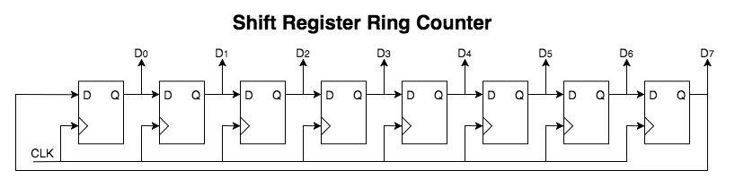
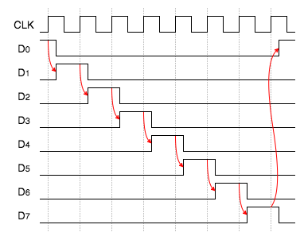
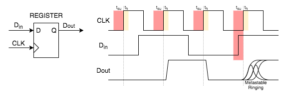
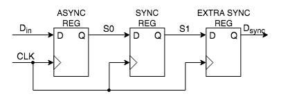
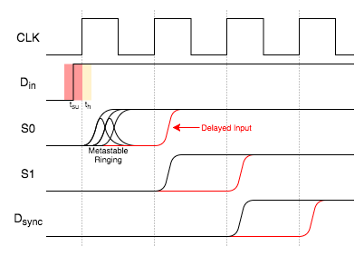

# Lab #3 HDL Component Reference

This document describes useful components that will be needed for this lab.


# HDL Constructs


## Generate Blocks

Generate blocks provide the ability to programmatically instantiate logic at compile time.  When used with parameters, generate statements can produce extremely flexible code modules.

Generate blocks can use conditional and looping operators to implement assignments, process blocks and module instantiations.

### Generate For Loops

The following example shows how to use a parameter with a generate block to set the loop count of a _**for**_ statement.  This is a very typical use case.

In the example, an instance of the module **Data\_Module** is instantiated for each data signal.  The parameter **DATA\_WIDTH** sets the width of the input and output data signals (**DIN** and **DOUT**) and also the number of modules created in the generate block.  This mechanism allows the **Generate_Module** module to be used with any size data bus without changing any code.


**Verilog:**

:information_source: In Verilog, a generate _**for**_ loop must be labeled as shown in the example below with the label _data\_module\_gen_.  Multiple or nested _**for**_ loops can be used per generate block.

Key Notes:

* Generate variables created with `genvar` are used only with generate _**for**_ loops.
* The for increment does not support the C increment operator, `i++`, so you have to explicitly use `i=i+1` (or any other increment value you want).
* The generate block is expanded at compile time so for loop parameters used must be static and can not change during runtime.

```verilog
module Generate_Module
#(
	parameter DATA_WIDTH = 16
)
(
	input  [DATA_WIDTH-1:0] DIN,
	output [DATA_WIDTH-1:0] DOUT,
	input  CLK
);

	genvar i;

	generate
	begin
		for (i=0; i < DATA_WIDTH; i=i+1)
		begin : data_module_gen
	
			Data_Module data_inst
			(
				.IN( DIN[i] ),
				.OUT( DOUT[i] ),
				.CLK( CLK )
			);
		
		end
	end
	endgenerate

endmodule
```

**VHDL:**

```vhdl
library IEEE;
use IEEE.STD_LOGIC_1164.ALL;

entity Generate_Module is
generic (
	DATA_WIDTH : integer := 16
);
port (
	DIN : in std_logic_vector(DATA_WIDTH-1 downto 0);
	DOUT : out std_logic_vector(DATA_WIDTH-1 downto 0);
	CLK : in std_logic
);
end entity;

architecture structural of Generate_Module is
begin

	data_module_gen : for i in 0 to DATA_WIDTH generate

		data_inst : Data_Module 
		port map
		(
			IN => DIN(i),
			OUT => DOUT(i),
			CLK => CLK
		);

	end generate data_module_gen;

end structural
```

### Generate Conditionals

Generate blocks can also instantiate logic conditionally using ***if-else*** statements.

The following code example is from the [**CDC\_Input\_Synchronizer**](../Lab3-Project/CDC_Input_Synchronizer.v) module which is included with the Lab 3 framework.

The module creates a synchronization chain of registers.  The length of the register chain can be set using the `SYNC_REG_LEN` parameter.  If the parameter is less than 1 then no registers are implemented.  When greater than 1, the first register connects to the `async_reg` while the rest are connected to the previous `sync_reg` output.  The _**if**_ statement in the generate block allows for this implementation flexibility which can completely alter a module's functionality based on the given parameters.

**Verilog:**

```verilog
parameter SYNC_REG_LEN = 2

genvar i;	
generate
begin
	if (SYNC_REG_LEN < 1)
	begin	
		assign SYNC_OUT = async_reg;	
	end
	else
	begin
		reg [SYNC_REG_LEN-1:0] sync_reg;
		
		assign SYNC_OUT = sync_reg[SYNC_REG_LEN-1];
		
		for (i=0; i < SYNC_REG_LEN; i=i+1)
		begin : sync_reg_gen
			if (i == 0)
			begin
				always @(posedge CLK)
				begin
					sync_reg[i] <= async_reg;
				end
			end
			else
			begin
				always @(posedge CLK)
				begin
					sync_reg[i] <= sync_reg[i-1];
				end
			end
		end
	end
end
endgenerate
```

---

# FPGA Component Reference

## Shift Registers

[Shift registers](https://en.wikipedia.org/wiki/Shift_register) are commonly used in serial data controllers, data pipelines, or computational functions.  In an FPGA, shift registers are easily implemented by connecting registers together in any length needed. Most current FPGA families have dedicated routing features optimized for shifting data to neighboring cells. 

Shift registers can be structured and used in a number of different ways.

* Serial-in, Parallel-out (serial receiver)
* Parallel-load, Serial-out (serial transmitter)
* Linear-feedback Shift Register (cryptography)
* Serial-in, Serial-out (Delay-lines)
* Serial Loop-Back, Parallel-out (Ring Counters)

The following example demonstrates an 8-bit shift register used as a [Ring Counter](https://en.wikipedia.org/wiki/Ring_counter).



On the rising clock edge, each register will load the data from previous register in the chain.  The following timing diagram shows the register outputs when initializing one bit high and the remainder low.  The single high bit will circulate though the register, looping around at the end.



The HDL implementation for the Shift Register Ring Counter example is shown below.

**Verilog:**

```verilog
reg  [7:0] shift_reg;

initial
begin
	shift_reg[0] = 1'b1;    // Initialize first bit high
	shift_reg[7:1] = 7'h00; // Initialize remaining bits low
end

always @(posedge CLK)
begin
	// Continuously Rotate Data Left
	shift_reg <= { shift_reg[6:0], shift_reg[7] };
end
```

### Shift Register Data Assignments

The **concatenation** operator is used to create the shift in the register values by remapping each register's output to its neighbor's input.  Unused output bits (ones not mapped back to the input) are said to be ***shifted-out*** of the register.

Shift registers can map data in a number of ways depending on the application.

|  Shift Type  |  Concatenation Syntax |
|--------------|:---------------------:|
| Left-shift rotation  | `{ sreg[6:0], sreg[7] }` |
| Right-shift rotation | `{ sreg[0], sreg[7:1] }` |
| MSB data output      | `{ sreg[6:0], 1'b0 }` |
| LSB data output      | `{ 1'b0, sreg[7:1] }` |
| MSB data input       | `{ DIN, sreg[7:1] }` |
| LSB data input       | `{ sreg[6:0], DIN }` |


The terms **MSB** (Most Significant Bit) and **LSB** (Least Significant Bit) are import terms when discussing Shift Registers.  They describe either the left most bit (MSB) or right most bit (LSB) in the register.  In most applications, shift register data is either shifted to the right or to the left.  On each shift, the end bits will have new data shifted-in and old data shifted-out.  Where the new data comes from or the old data goes depends entirely on the application.

For instance, a shift register used in a serial transmitter application, the shifted-out data would be the next bit to transmit so would be send to transmitter.  For a serial receiver, the received data would be the new data shifted-in to the shift register.


### Additional Shift Register Uses

The [Linear-Feedback Shift Register](https://en.wikipedia.org/wiki/Linear-feedback_shift_register) (LFSR) can generate pseudo-random noise patterns which are useful in a number of applications. Later labs will utilize [CRC](https://en.wikipedia.org/wiki/Cyclic_redundancy_check) and Parity calculations which are closely related to LFSRs.

```Verilog
wire      fb; // feedback
reg [7:0] sr; // shift register

initial
begin
	sr <= 8'hFF;  // initialize to all 1's
end

assign fb = sr[7]; // Feedback Most-Significant-Bit (MSB)

always @(posedge CLK)
begin
	// Feedback XOR'd on tap points (4, 5, 7)
	sr <= { sr[6]^fb, sr[5], sr[4]^ fb, sr[3]^ fb, sr[2], sr[1], sr[0], fb }
end
```

### Parametrized Variable Length Shift Registers

Parameters can be used to customize the length of a shift register allowing more flexible code to be written.

The following example shows a simplified module used to send data to a serial DAC.  The parallel data is loaded into the shift register using the `LOAD_DATA` signal.  Then the data is shifted out each time the `NEXT_BIT` signal is asserted.  The parameter allows the same module to be used with any length DAC data.

**Verilog:**

```Verilog
module DAC_Transmitter
#(
	parameter DAC_DATA_LEN = 24
)
(
	// DAC Data Signals
	input                    LOAD_DATA,
	input [DAC_DATA_LEN-1:0] DAC_DATA,
	
	// Output Control Signals
	input   NEXT_BIT,	
	output  DAC_OUT,
	
	// System Signals
	input CLK
);

	reg   [DAC_DATA_LEN-1:0] shift_reg;

	// Output the MSB data first
	assign DAC_OUT = shift_reg[DAC_DATA_LEN-1];

	always @(posedge CLK)
	begin
		if (LOAD_DATA)
			shift_reg <= DAC_DATA;
		else if (NEXT_BIT)
			shift_reg <= { shift_reg[DAC_DATA_LEN-2:0], 1'b0 };  // Shift Left
	end

endmodule
```

**NOTE:** Pay careful attention to the indexing used to select the bit ranges for the shifting.  

* The index is 0-based so the MSB is always one less than the total number of register bits (`DAC_DATA_LEN-1`).  
* When using concatenations, remember to adjust the indexes to account for the number of appended bits.  
* The number of bits in the concatenation must equal the full register width (e.g. MSB removed to append new LSB `{ shift_reg[DAC_DATA_LEN-2:0], 1'b0 }`).


## Input Signal Synchronization

Most input signals into an FPGA occur asynchronously to the system clock (one exception, covered in a later lab, would be source synchronous signals).  The Push Button and Slider Switch input signals needed for the Lab 3 assignment are prime examples of asynchronous signals that will be addressed here.

### Register Metastability

Registers typically sample the data input signal at the rising clock-edge of the sample clock.  For each rising clock-edge, the input signal must be stable before the clock-edge (setup time) and after the clock-edge (hold time).  These parameters can be found in most datasheets listed as **t<sub>su</sub>** for setup time and **t<sub>h</sub>** for hold time.

When the input data signal violates these setup and hold requirements, the register output may end up in a **metastable** state which could resolve to either the right answer or the wrong answer.  This indecision period where the output bounces between logic levels is referred to as **metastable ringing**.  The time spent ringing extends the propagation time of the register so even if the correct answer is output, it may be too late.

The following timing diagram shows the normal operation and the metastable operation of a register.



For more information about how metastability effects FPGAs see this white paper: [Understanding Metastability in FPGAs](wp-01082-quartus-ii-metastability.pdf).

Luckily, both Altera and Xilinx have spent a considerable amount of effort in both hardware design and software tools to mitigate the metastability problem in modern FPGAs.  For the most part, your designs should not have metastability issues if you follow some simple design rules which will be discussed here and in future labs.

### Asynchronous Input Signal Synchronization

When dealing with asynchronous signals, violating the setup and hold times of a register is unavoidable.  The goal is to mitigate the metastable effect on the system as much as possible.

Passing an input signal though a series of registers is the most basic synchronization strategy.



The first register in the chain, the **Async Reg** will experience metastable events.  The second register in the chain, the **Sync Reg**, buffers the metastable ringing from the rest of the system.  Depending on the MTBF requirements, additional registers can be added to the chain to further increase the protection.

The timing diagram below shows what happens during a metastable event.



The rest of the system will be shielded from the metastable ringing but the incoming signal may be delayed a clock cycle depending on how the first register settles out.  This delay can be problematic when trying to synchronize multiple related signals such as in a parallel bus.  There are other synchronization schemes for buses but the Push Button and Slider Switch inputs can be considered individual for this lab so the more complicated synchronization schemes can be left for later labs.

### CDC Input Synchronizer

The `CDC_Input_Synchronizer` module implements a synchronization register chain as described in the previous section.  CDC stands for Clock Domain Crossing and will be seen again in later labs when discussing multiple clock domain designs.

The module is parametrized so the number of synchronization registers can be adjusted depending on the design requirements.  Most designs would have one or two synchronization registers.  Changing the number of registers affects the MTBF calculation for the synchronizer, although, for the Cyclone V and the small amount of synchronizers used, the MTBF is in the billion of years range regardless.

### MTBF (Mean Time Between Failure)

Quartus has the capability to calculate MTBF for detected synchronizers.  The Metastability Report can be viewed in the TimeQuest Timing Analyzer.  For small designs like the lab assignments, the report will be uninteresting but for larger projects with multiple clock domains this could prove a very useful tool to have available.

The formula for calculating MTBF was discussed in the [Understanding Metastability in FPGAs](wp-01082-quartus-ii-metastability.pdf) white paper.

---

Return to the [Lab 3 Project Guide](Lab3-ProjectGuide.md) page...
