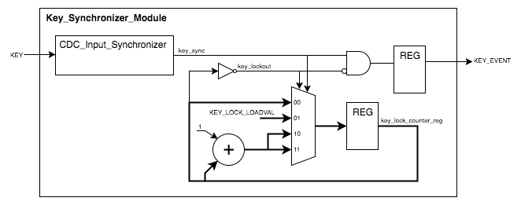
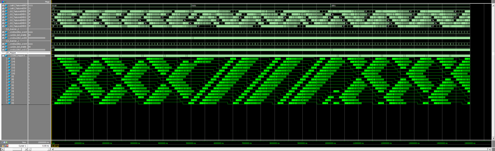

# Lab #3 Project Guide

## Overview

This lab builds off the previous lab by reusing and refactoring components from the **CLS Scanner Module**.  The scanner will be adapted to display multiple LED POV streams using the Seven-Segment LED Display.  A spinner wheel of sorts will be created using the outer ring of the display and controlled using the four push buttons.

New design techniques will be introduced to properly synchronize and debounce the input signals from the push buttons and slider switches.  External signals must always be synchronized with the system clock before being used to avoid metastability issues.  Typical synchronization techniques will be presented, along with a cursory overview of metastability and clock domain issues.

The lab introduces the [Shift Register](Lab3-ComponentReference.md#shift-registers), which is a key design construct in many FPGA applications and will be used in a number of future labs.  In this lab, two different uses of a Shift Register are demonstrated.  

* In the first, the Shift Register is used as a delay pipeline for the input signal synchronization. This configuration uses a simple Serial-In, Serial-Out chain.  
* In the second, the Shift Register is used as a memory to store the index of the currently active LED.  As the Spinner Wheel rotates, the active LED indicator will shift position inside the Shift Register.  This configuration uses the same Serial-In, Serial-Out structure but includes a Parallel-Out so the individual LED status can be read.  The serial output is looped back to the serial input creating a circular buffer (which is found in many filter applications).


### Project Assignment Overview

* Create the Quartus Project
* Review the Lab Project [System Architecture](#system-architecture)
* Implement the design components following the [Lab Implementation Requirements](#lab-implementation-requirements)
* Debug the design using the [Simulator](#debugging-with-simulation)
* Load the built design on the [development board](#load-the-design-on-the-dev-board)
* Document the results for the lab report
* Commit the finished design back into source control


## System Architecture

The following diagram shows the top level system design for Lab 3.


### Module Hierarchy

* `EECS301_Lab3_TopLevel`
	* `Key_Synchronizer_Module`
		* `CDC_Input_Synchronizer`
	* `Switch_Synchronizer_Module`
		* `CDC_Input_Synchronizer`
	* `CLS_Scanner_Module`
		* `CLS_PWM_Interval_Timer`
		* `CLS_PWM_DutyCycle_Timer`
		* `CLS_Fadeout_Timer`
		* `CLS_LED_Output_Fader`
	* `LED_Segment_Mapper`

### Development Board Hardware

This project utilizes the Seven-Segment LED Display, all four Push Buttons, and two Slider Switches from the development board.


* The outer ring of the Seven-Segment Display is used to display an animated pattern.
* The Push Buttons will control the LED scanning directions (left or right) for the two spinners.
* Two slider switches, SW[1:0], enable/disable the two separate LED patterns.

	| Enabled Pattern            | SW[1] | SW[0] |
	|----------------------------|:-----:|:-----:|
	| None                       |   0   |   0   |
	| LED Spinner 1 Enabled      |   0   |   1   |
	| LED Spinner 2 Enabled      |   1   |   0   |
	| LED Spinners 1 & 2 Enabled |   1   |   1   |
	
### Reused/Refactored Modules

In a real-world design environment, reusing code from previous projects is common in order to get products to market as fast as possible.  Part of the design process is evaluating what can be leveraged from the existing codebase and what would be more efficient to rewrite or refactor.

Reusing code that has been previously tested and verified is much faster than writing new code which must be validated.  Even if the existing codebase does not have the exact functionality needed, it is still often faster refactoring code which has similar structure than starting from scratch.

Refactoring code is simply taking existing code and reworking some parts to meet the design requirements.  For instance, if a module has 80% of the required functionality, it would be easier to add the remaining 20% instead of rewriting the whole module from scratch.

For this lab, two modules from the previous lab will be reused as-is and another module will be refactored.  The following modules from Lab 2 are utilized.

* **CLS\_PWM\_Interval\_Timer** (`CLS_PWM_Interval_Timer.v`)
* **CLS\_PWM\_DutyCycle\_Timer** (`CLS_PWM_DutyCycle_Timer.v`)
* **CLS\_Scanner\_Module** (`CLS_Scanner_Module.v`)

The implementation section discusses how the modules will be reused or refactored.

### Provided Framework

Once again, the lab includes a set of framework files to simplify some parts of the lab project.  Review the framework files for examples of proper coding techniques which may make completing the lab assignment easier.

The following list provides a description for each module (or file) included in the Lab 3 Framework:

* **EECS301\_Lab3\_TopLevel** (`EECS301_Lab3_TopLevel.v`)

	This is the top level module for the design.  The `EECS301_Lab3_TopLevel` module instantiates multiple instances of the `Key_Synchronizer_Module`, the `Switch_Debounce_Synchronizer`, and the `CLS_Scanner_Module` using generate blocks.
	
* **CDC\_Input\_Synchronizer** (`CDC_Input_Synchronizer.v`)

	The `CDC_Input_Synchronizer` module implements a register chain to synchronize an input signal to the clock domain.  The module has a parameter to set the chain length. 
	
	Refer to the [HDL Reference Guide](Lab3-ComponentReference.md#input-signal-synchronization) for more information.

* **Key\_Synchronizer\_Module** (`Key_Synchronizer_Module.v`)

	A code shell is provided as a starting point for the `Key_Synchronizer_Module` module implementation.  See the [Key Synchronizer Module](#key-synchronizer-module) section for implementation details.

* **Switch\_Debounce\_Synchronizer** (`Switch_Debounce_Synchronizer.v`)

	The `Switch_Debounce_Synchronizer` module has been provided with the Lab Framework.  Reviewing this file may help with the Key Synchronizer Module, although they do differ in functionality.

	Like the Key inputs, the Slider Switch input signals must be synchronized with the system clock.  Unlike the Key inputs, these switch inputs lack any hardware debouncing circuitry so the signals will need to be debounced as well.

	The `CDC_Input_Synchronizer` module synchronizes the Switch input signals to the system clock as was done with the Key inputs.

	The debounce controller monitors the input signal and whenever a change occurs the debounce timer is started.  If the input does not change before the timer elapses then the new input state is output.  If the input does change then it's ignored as a false glitch and the timer is restarted.  The timer used is similar to that used for the Key Synchronizer pacing timer.

	For this application, only the current states of the Slider Switches are needed.  Event pulses do not have to be generated as was done for the Key presses.

* **LED\_Segment\_Mapper** (`LED_Segment_Mapper.v`)

	The `LED_Segment_Mapper` module has been provided with the Lab Framework.  The module routes the two sets of LED data to the outer ring of the Seven Segment LED Displays.  This is mostly trivial logic with some tedious signal mapping.
	
	Review the module to see how it works.  Make note of how the LED Segment Mapper combines the two LED Scanner streams together and maps the LED data to the outer ring of the Seven-Segment LED Displays.

	The LED Enable signals (`LED_ENABLE_1` and `LED_ENABLE_2`) are AND'ed with the LED Scanner outputs (`LED_DATA_1` and `LED_DATA_2`) to enable or disable that scanner output.  The result from each LED Scanner is combined by OR'ing them together.  This results in the two LED Scanner streams sharing the LEDs.

	The result is registered before being output from the FPGA to mitigate timing issues.  Signals leaving the chip incur extra delay time due to the pin capacitance so it is a good idea to register the combinatorial logic before leaving the chip to insure signal consistency.

* **CLS\_LED\_Output\_Fader** (`CLS_LED_Output_Fader.v`)

	A code shell is provided as a starting point for the `CLS_LED_Output_Fader` module implementation.  See the [CLS LED Output Fader](#cls-led-output-fader) section for implementation details.

* **CLS\_Scanner\_Module** (`CLS_Scanner_Module.v`)

	The `CLS_Scanner_Module` will be refactored from Lab 2.  A modified version of the module has been provided with the framework to get the refactoring started.  See the [CLS Scanner Module](#cls-scanner-module) section for implementation details.

* **TF\_EECS301\_Lab3\_TopLevel** (`TF_EECS301_Lab3_TopLevel.v`)

	The `TF_EECS301_Lab3_TopLevel` module is the simulation test bench for the `EECS301_Lab3_TopLevel` module.  See the [EECS301 Lab3 TopLevel Test Bench](#eecs301-lab3-toplevel-test-bench) section for details.

* **TF\_CLS\_LED\_Output\_Fader** (`TF_CLS_LED_Output_Fader.v`)

	The `TF_CLS_LED_Output_Fader` module is the simulation test bench for the `CLS_LED_Output_Fader` module.  See the [CLS LED Output Fader Test Bench](#cls-led-output-fader-test-bench) section for details.


* Include File (`StdFunctions.vh`)

	This is a Verilog Include File which can be used to share common code among different modules.  In this case, a helper function `bit_index()` is provided to simplify the calculation of the timer parameters.

* Project Assignments File (`Lab3_Project_Assignments.qsf`)

	This file contains the pin assignments and some other assignment settings for the design.  The file must be imported during the Quartus Project creation.
	
* Timing Constraints File (`EECS301_Lab3_Project.sdc`)

	This file specifies the timing constraint goals, for every signal, the synthesizer will use when compiling the design.  Applying proper timing constrains is a crucial part of FPGA development.  This topic will be discussed in more detail in later labs.  For now, the timing constrains have been provided for this project.

---

## Lab Implementation Requirements

The following section details the implementation requirements for the lab assignment, broken down by module.

### Implementation Reference List

For quick reference, here's the list of modules that require development effort:

* [CLS\_PWM\_Interval\_Timer](#red_circle-cls-pwm-interval-timer)
* [CLS\_PWM\_DutyCycle\_Timer](#red_circle-cls-pwm-duty-cycle-timer)
* [CLS\_Fadeout\_Timer](#red_circle-cls-fadeout-timer)
* [CLS\_LED\_Output\_Fader](#red_circle-cls-led-output-fader)
* [CLS\_Scanner\_Module](#red_circle-cls-scanner-module)
* [Key\_Synchronizer\_Module](#red_circle-key-synchronizer-module)


### :red_circle: CLS PWM Interval Timer

The Lab 2 `CLS_PWM_Interval_Timer` module will be reused for Lab 3 without any changes necessary.  

**Implementation Steps:**

1. Copy the `CLS_PWM_Interval_Timer.v` file from your Lab 2 project into the `Lab3-Project` directory.

1. Add the module to the Quartus project by selecting from the menubar **Project** -> **Add/Remove Files in Project...**.  Use the **Files** dialog to add the `CLS_PWM_Interval_Timer.v` file to the project.

1. The module is now part of the project.  No other steps are required.

### :red_circle: CLS PWM Duty Cycle Timer

The Lab 2 `CLS_PWM_DutyCycle_Timer` module will be reused for Lab 3 without any changes necessary.  

**Implementation Steps:**

1. Copy the `CLS_PWM_DutyCycle_Timer.v` file from your Lab 2 project into the `Lab3-Project` directory.  

1. Add the module to the Quartus project by selecting from the menubar **Project** -> **Add/Remove Files in Project...**.  Use the **Files** dialog to add the `CLS_PWM_DutyCycle_Timer.v` file to the project.

1. The module is now part of the project.  No other steps are required.

### :red_circle: CLS Fadeout Timer

The Lab 2 `CLS_PWM_Interval_Timer` module will be refactored for this lab to implement the `CLS_Fadeout_Timer`.  Refactoring code often makes development faster when an existing module has functionality near that of the target specification.

The `CLS_Fadeout_Timer` module will output a single clock pulse at the interval rate set by the `FADE_RATE_HZ` parameter value.  The `CLS_PWM_Interval_Timer` module has this same functionality so use it as the starting point.  

**NOTE:** In this case, the `CLS_PWM_Interval_Timer` module could be used directly but doing so creates a linkage between the two separate functional blocks which may cause issues later on if the requirements change for either the Fadeout timer or the PWM timer.  Modifying the PWM may unintentionally break the Fadeout timer. Creating a new module removes that linkage and makes code maintenance later on safer.

**Implementation Steps:**

1. Copy the `CLS_PWM_Interval_Timer.v` file from your Lab 2 project into the `Lab3-Project` directory, changing the name to `CLS_Fadeout_Timer.v`.

1. Open the `CLS_Fadeout_Timer.v` file in an editor (i.e. Notepad++ or Quartus).  

1. Change the module name from `CLS_PWM_Interval_Timer` to `CLS_Fadeout_Timer` in both the module definition and in the comment header.

1. Save and close the file.

1. Add the module to the Quartus project by selecting from the menubar **Project** -> **Add/Remove Files in Project...**.  Use the **Files** dialog to add the `CLS_Fadeout_Timer.v` file to the project.

1. Open the file again for editing (using Quartus this time).

1. Rename the module parameter `DUTY_RATE_HZ` to `FADE_RATE_HZ` and set the default value to 10 Hz.

1. Rename the `PWM_TICK` output signal to `FADEOUT_TICK` and update any uses of the variable name.

1. The remainder of the module functionality matches what is required.  Update any comments or variable names so they make sense with the new module usage.  Then save your changes.


### :red_circle: CLS LED Output Fader

In the previous lab, the `CLS_LED_Output_Multiplexer` module rotated through a fixed sequence of frames.  For this lab a more dynamic output control will be implemented with these features:

* When the `LED_FULL_ON` input is asserted, an LED's output will go to full brightness.
* `LED_FULL_ON` will only be asserted for one LED at a time. This is the _**Active LED**_. 
* There will be 8 levels of brightness from Full-On to Off.
* Multiplexing the output from fixed duty-cycle PWM modules create the various brightness level output (similar to the previous lab).
* Each LED output will independently fade from Full-On to Off at the rate set by the `FADE_TIMER_TICK` input signal.
* The Fade-out will start when `LED_FULL_ON` is de-asserted for the Active LED. 

The animation effect will be produced by moving the Active LED in the direction specified by the user and letting the previously active LED begin fading.  By moving the Active LED faster than the fade-out rate, a dynamic POV trail will be created.

The `CLS_LED_Output_Fader` module implements a single LED controller, which is replicated by the `CLS_Scanner_Module` module for each LED output using a _**generate**_ statement.  This reduces the amount of code required and makes the module more flexible if the number of LEDs changes.

The following diagram shows the basic logic structure for the module.


The block marked **\*LUT** determines the LED brightness level using the following logic rules.

* If the `LED_FULL_ON` signal is asserted then the output will be set to the maximum (3'h7).
* If the `LED_FULL_ON` signal is not asserted then the brightness level will be reduced by one level every time `FADE_TIMER_TICK` asserts until the `led_brightness_reg` is zero.

The logic can be implemented with either an _**if-else-if**_ statement or with a _**case**_ statement.  Either statement structure will result in the same LUT logic being synthesized so its best to pick the code structure which is easiest to understand.

**NOTE:** The following behaviors are implied but do not require additional logic when using an if-else-if construct. A case statement may have to account for these options.

* If `led_brightness_reg` is zero, then the register is not changed when `FADE_TIMER_TICK` asserts.
* If neither the `LED_FULL_ON` or `FADE_TIMER_TICK` signals are asserted then the `led_brightness_reg` register retains its current value.


**Implementation Steps:**

1. Open the `CLS_LED_Output_Fader.v` file that has been provided with the framework. 

1. The **\*LUT** logic used to implement the `led_brightness_reg` register was described previously but is summarized in the following table. 

	| LED\_FULL\_ON | FADE\_TIMER\_TICK | led\_brightness\_reg | LUT Output | Note |
	|:-----:|:-----:|:-----:|:------:|----|
	|   1   |   X   |   X   |  3'h7  | Max Value |
	|   0   |   1   |  != 3'h0 |  led\_brightness\_reg - 1'b1  | Reduce by 1 |
	|   0   |   1   |  == 3'h0   |  3'h0  | Off |
	|   0   |   0   |   X   |  led\_brightness\_reg | No Change |
   
   Implement the logic using either an _**if-else-if**_ statement or using a _**case**_ statement.  The output from the LUT feeds the `led_brightness_reg` register.  
   
   :information_source: The LUT logic and `led_brightness_reg` register can be implemented in the same [registered process block](HDL-StarterGuide.md#registers).
   
   **NOTE:** In Verilog, the `==` operator tests if two values are equal, and the `!=` operator tests if two values are not equal.
   
1. Implement the `led_mux_select` register as show in the block diagram.

1. Implement the `LEDR` output using a [registered multiplexer](HDL-StarterGuide.md#registered-multiplexer) to make the assignments listed in the following table.

	| Brightness | led\_mux\_select | LEDR Output |
	|:----:|:----:|:----:|
	| Off | 3'b000 | 1'b0 |
	|     | 3'b001 | PWM\_CHANNEL\_SIGS[0] |
	|     | 3'b010 | PWM\_CHANNEL\_SIGS[1] |
	|     | 3'b011 | PWM\_CHANNEL\_SIGS[2] |
	|     | 3'b100 | PWM\_CHANNEL\_SIGS[3] |
	|     | 3'b101 | PWM\_CHANNEL\_SIGS[4] |
	|     | 3'b110 | PWM\_CHANNEL\_SIGS[5] |
	| Max | 3'b111 | PWM\_CHANNEL\_SIGS[6] |

1. The code implementation can be tested and verified using the `TF_CLS_LED_Output_Fader` test bench provided with the framework.  See the [**CLS LED Output Fader Test Bench**](#cls-led-output-fader-test-bench) section for more information about the simulation test bench.

### :red_circle: CLS Scanner Module

The `CLS_Scanner_Module` module will be refactored from the previous lab.  The Lab Framework includes a modified version of the module to use as a starting point for the refactoring.

The following block diagram shows the new functionality of the module.


:information_source: Yes, that's a lot of modules.  Luckily, Verilog provides the **generate** mechanism to automatically instantiate multiple copies of a module with different inputs, outputs and/or parameters.  This greatly simplifies the code and makes it easier to create modules like this using parameters to control the generation process.

**Refactoring Overview**

* The `CLS_Fadeout_Timer` module replaces the `CLS_Scan_Rate_Timer` module.

* The `CLS_PWM_Interval_Timer` instantiation remains unchanged.

* The new **CLS Scanner** requires only seven PWM channels instead of the ten previously constructed by the `CLS_PWM_DutyCycle_Timer` generate block.

* An LED Position Shift Register has been added to keep track of the currently active LED.  The shift register is initialized with a single active-high bit.  The register will rotate left or right depending on the key inputs.  The bit from either end is shifted-out and loops to the other end of the register.  This type of shift register configuration is called a Ring Counter.

	NOTE: This shifting scheme does not have a failure mechanism to prevent a [Single Event Upset (SEU)](https://en.wikipedia.org/wiki/Single_event_upset) from causing the shift register to contain either zero or more-than-one active bit. If an error occurs, it will propagate causing the display to show the wrong output. For a lab assignment this is acceptable, but for a production design failure modes would need to be considered. 

* The `CLS_LED_Output_Multiplexer` module has been replaced with an instance of the `CLS_LED_Output_Fader` module for each LED.  A generate block should be used to create these instances to simplify the code.

**Implementation Steps:**

1. Open the `CLS_Scanner_Module` file which was included with the lab framework.

1. Instantiate the `CLS_Fadeout_Timer` module to replace the `CLS_Scan_Rate_Timer`.

	* Remove the commented `CLS_Scan_Rate_Timer` instantiation block and insert the instantiation for the newly refactored `CLS_Fadeout_Timer` module.  
	* Change the `srt_tick` signal name to `fadeout_tick`.  
	* Pass the `FADE_RATE_HZ` parameter to the module, otherwise the simulation will take a long time.
	* Update any comments to reflect the new changes.

1. Implement a Shift Register using the ring counter example from the [HDL Reference Guide](Lab3-ComponentReference.md#shift-registers) as reference.

	a. The module parameter `LED_NUM` specifies the number of LEDs being controlled.  The width of the shift register should be the same as the number of LEDs.  In this case, the width is 16-bits to match the number of ring LEDs.
	
	b. The `led_pos_reg` register variable declaration has been provided.  Use this for the shift register.
	
	c. When the `RIGHT_KEY_EVENT` is asserted, the shift register should rotate the data to the right (looping the LSB to the MSB position).
	
	d. When the `LEFT_KEY_EVENT` is asserted, the shift register should rotate the data to the left (looping the MSB to the LSB position).
	
	e. If both the `RIGHT_KEY_EVENT` and the `LEFT_KEY_EVENT` are asserted at the same time, then the `RIGHT_KEY_EVENT` should take precedence.  This would be implemented using an if-else-if construct to set the priority of each signal.
	
	f. The register assignments should use the `LED_NUM` parameter when shifting the data to compute the vector indexes.  The following shows how the left shift assignment would be constructed:
	
	```verilog
	led_pos_reg <= { led_pos_reg[LED_NUM-2:0], led_pos_reg[LED_NUM-1] };
	```
	
1. Instantiate a `CLS_LED_Output_Fader` module per LED (specified by the `LED_NUM` parameter) using a **generate** _for-loop_.  

	**NOTE:** Refer to the Generate [HDL Component Reference](Lab3-ComponentReference.md#generate-blocks) section for detailed information or use the `CLS_PWM_DutyCycle_Timer` generate block _for-loop_ as an example.

	a. The generate _for-loop_ should use the `LED_NUM` parameter to set the number of `CLS_LED_Output_Fader` modules created.  Using the parameter will make the code more flexible for future use.
	
	b. The output from the shift register, `led_pos_reg`, is used to signal when the LED output should go high.  The _for-loop_ index should be used to select each register bit to feed to the `LED_FULL_ON` input on each `CLS_LED_Output_Fader` instance.
	
	c. The `LEDR` output on each `CLS_LED_Output_Fader` instance should connect to the `LED_OUT` signal using the _for-loop_ index for each LED.
	
	d. The `fadeout_tick`, `pwm_timer_tick`, and `pwm_channel_sigs` signals are commonly used by all modules.

### :red_circle: Key Synchronizer Module

The previous labs used the push button inputs with little regard for properly synchronizing the inputs to the system clock before using the signals.  This may work on your lab bench but designs fielded in the real world will fail.  

The `Key_Synchronizer_Module` synchronizes the asynchronous input signal using the common register chain structure shown in the following diagram.


The [HDL Reference Guide](Lab3-ComponentReference.md#input-signal-synchronization) has a full explanation of how this synchronizer chain works.  The implementation has been provided with the framework in the `CDC_Input_Synchronizer` module.  Review this module to see how it works but be aware there are a couple device specific components that would have to be adjusted when porting to other FPGA families.

The DE1-SoC Development Board includes hardware debouncing circuitry on the KEY input signals so no additional debouncing is required.  Note that synchronizing and debouncing are not the same thing.  Here's a good overview on why debouncing is needed: [A Guide to Debouncing](http://www.ganssle.com/debouncing.htm).

The `KEY_EVENT` output from the module will generate a single clock pulse every time the key is pressed.  A pacing timer prevents too many back-to-back key presses from being generated with the added benefit of a key press repeater if the button is held down.

The pacing timer uses a counting structure similar to the `CLS_Scan_Rate_Timer` module from the previous lab but with an additional feature.  Unlike the CLS Scan Rate Timer which counts continuously, the pacing timer stops counting after the pacing time has expired and waits until the push button is pressed again.  If the push button is held down, then it will start immediately.

The block diagram show the basic functionality of the module.



**Implementation Steps:**

1. Open the `Key_Synchronizer_Module` module which was provided with the framework.

	The `CDC_Input_Synchronizer` module instantiation has been provided with the framework.  The output signal from the module, `key_sync`, is the synchronized Key input.
	
	The `key_lock_out` signal is provided with the framework.  When the rollover counter is active, the key lockout is true.  When the counter is finished the key lockout is released.  This logic is determined by the inverse of the counter rollover bit (MSB).
	
1. Implement a register for the output signal `KEY_EVENT` using the following logic table for the `KEY_EVENT` value.

	| `key_lock_out` | `key_sync` | `KEY_EVENT` |
	|:---:|:---:|:---:|
	|  0  |  0  |  0  |
	|  0  |  1  |  1  |
	|  1  |  0  |  0  |
	|  1  |  1  |  0  |

	NOTE: Simple logic like this should typically be implemented using a direct equation or an _if_ statement rather than a _case_ statement to improve code readability.  The _if_ statement is usually more intuitive without additional comments explaining what's going on.  Which of the three options listed below seem more understandable to you?
	
	```verilog
	// Direct Equation
	X <= a & ~b;
	
	// If Statement
	if (a & ~b)
		X <= 1'b1;
	else
		X <= 1'b0;
	
	// Case Statement
	case ({b, a})
		2'b00 : X <= 1'b0;
		2'b01 : X <= 1'b1;
		2'b10 : X <= 1'b0;
		2'b11 : X <= 1'b0;
	endcase	
	```
	
1. Implement a rollover counter for the pacing timer using the register signal name `key_lock_counter_reg`.  The framework provides the parameter calculations, signal declarations and initial register value.

	The timer starts counting when the `key_sync` signal is asserted.  When the counter hits the rollover it stops and waits for the next `key_sync` assertion.  While the timer is actively counting the `key_lock_out` is asserted to show no key presses are allowed.
	
	The following logic table shows the described functionality for the `key_lock_counter_reg` register.
		
	| `key_lock_out` | `key_sync` | `key_lock_counter_reg` |
	|:---:|:---:|:---:|
	|  0  |  0  |  `key_lock_counter_reg`  |
	|  0  |  1  |  `KEY_LOCK_LOADVAL`  |
	|  1  |  0  |  `key_lock_counter_reg + 1'b1`  |
	|  1  |  1  |  `key_lock_counter_reg + 1'b1`  |
	
	**NOTE:** The value listed in the `key_lock_counter_reg` column is the value assigned to the `key_lock_counter_reg` register (`key_lock_counter_reg <= key_lock_counter_reg;`).  The first line has `key_lock_counter_reg` assigned to itself.  This basically means that the register value does not change.  If using a case statement, this needs to be explicitly declared but when using an if statement it can be inferred by not assigning any value for that condition.


## Debugging with Simulation 

Two simulation test bench modules have been provided with the framework for you to debug and verify your code implementation.

### Dealing with Multiple Test Benches

The Quartus mechanism for dealing with multiple test bench simulations is a little weird and somewhat annoying.  

Multiple test bench setups can be created following the same procedure used in the previous labs.  The different test benches can be selected from the **Compile test bench** drop-down list on the Simulation Settings page.  Whatever test bench is selected in the drop-down is the active simulation when running the RTL Simulation command.

The annoying part is that the Simulation Setup Script is not remembered when changing simulations so you have to manually change it every time you switch simulations.  To make this somewhat easier, the Simulation Setup `.do` files have been labeled with the test bench name they are used for.

:warning: When switching simulations always remember to change the Simulation Setup Script as well.

### CLS LED Output Fader Test Bench

The `CLS_LED_Output_Fader` module is instantiated as the UUT.  The CLS Fadeout Timer and PWM Channel modules were leveraged from the CLS Scanner Module to create the necessary input signals to the UUT.

**NOTE:** Leveraging existing design modules to emulate signals for the module being tested is a common practice to save development time, but you do have to be careful that design flaws are not being masked by using untested code to test other untested code.

The `FADE_RATE_HZ` and `PWM_DUTY_RATE` frequencies were increased to make the simulation time shorter.  The simulation normally would require 1 second to run though the full sequence but now, by increasing the `FADE_RATE_HZ` frequency by a factor of 1000, the simulation only requires 1 ms of time to see the full test sequence.  This is a convenient trick when the absolute timing is not important to the testing results.

The simulation test pulses the `LED_FULL_ON` input signal then the fade out sequence can be verified.  This is a _Functional Check_ simulation so it's up to the designer to verify the test results manually by looking at the simulation waveforms.

**Test Bench Configuration Steps:**

Before running the simulation the Test Bench setting need to be configured using a slightly modified procedure from the previous labs.

1. Switch the **Tasks** pulldown to **RTL Simulation** then run **Edit Settings** for the RTL Simulation.

2. Select **Compile test bench** and click on the **Test Benches...** button.

3. Click the **New...** button to create a new test bench.

4. Enter the following information:

	* **Test bench name:** `TF_CLS_LED_Output_Fader`
	* **Top level module in test bench:** `TF_CLS_LED_Output_Fader`
	* Select **End Simulation at** and set the end time to **1 uS**.
	
	Next the files will need to be added but this will differ slightly because the `CLS_LED_Output_Fader` module has not been added to the main project hierarchy yet.  Quartus has a quirk when passing code to ModelSim, if a module is not linked to the Top Level module then it does not get passed to ModelSim.  In this case, the implementation for `CLS_Scanner_Module` is not yet complete so none of the modules used in the test bench are linked to the Top Level.  To work around this problem, the module files will have to be explicitly added to the simulation files list.
	
	Add the following files to the simulation files list:
	
	* TF\_CLS\_LED\_Output\_Fader.v
	* CLS\_LED\_Output\_Fader.v
	* CLS\_Fadeout\_Timer.v
	* CLS\_PWM\_Interval\_Timer.v
	* CLS\_PWM\_DutyCycle\_Timer.v
	 
	The final settings window should look like this:
	
	
	
	Click **OK** to save the test bench setup.
	
5. Click **OK** again to close the Test Bench dialog.
	
5. Back on the main **Settings** window...

	* Make sure the new `TF_CLS_LED_Output_Fader` test bench is selected in the **Compile test bench** drop-down list.

	* Set the Simulation Setup Script: `simulation/modelsim/TF_CLS_LED_Output_Fader.do`
	
	Click **OK** to save the simulator settings.
	
1. The simulation can now be launched by double-clicking **RTL Simulation** in the **Tasks** pane.

	With the modified frequency rates, the simulation test should complete in about 800 us so run the simulation for 1 ms.  The expected simulation results are shown below.

	**Expected Simulation Results**

	 

	**NOTE:** Your simulation image may look different if your run time or zoom level differs from the example.  The important thing is that the fade out PWM pattern shown on the LEDR signal starts Full-On then reduces to Off over the 7 steps.

	Issues to watch out for:

	* Any RED lines means you have uninitialized signals.  Make sure you provided initial values for the counter registers.
	* Check that the `PWM_TIMER_TICK` and `FADE_TIMER_TICK` signals are active and are generating ticks at the intended intervals.
	* The `led_brightness_reg` register should start at 3'h7 and step down, one at a time, to 3'h0.
	* Make sure the fadeout sequence does not repeat.  Once the LED Brightness Register reaches 3'h0 it should stay there, not rollover.

1. Export the waveform image showing correct functionality to include with the report.  The image should show the full fadeout sequence.  

	**NOTE:** The formatting of the image does not have to look exactly like the above image (which was captured on an Ultrawide monitor).  Just make sure the image shows the full test sequence and has the signal names visible.


### EECS301 Lab3 TopLevel Test Bench

The `TF_EECS301_Lab3_TopLevel` test bench sets up a basic test of the entire design.

**Test Bench Configuration:**

1. Create a new test bench and enter the following information:

	* **Test bench name:** `TF_EECS301_Lab3_TopLevel `
	* **Top level module in test bench:** `TF_EECS301_Lab3_TopLevel `
	* Select **End Simulation at** and set the end time to **1 uS**.
	* Add `TF_EECS301_Lab3_TopLevel.v` to the simulation files list.

	Save the test bench setup.
	
1. Select the test bench from the **Compile test bench** drop-down list.

1. Set the **Simulation Setup Script** to `simulation/modelsim/TF_EECS301_Lab3_TopLevel.do`

1. Run the simulation

	**Expected Simulation Results**

	Run the simulation for 15 ms.  The expected simulation results are shown below. 

	

	**NOTE:** Again your waveform may appear slightly different depending on the runtime and zoom level.  You're looking for no RED lines and the general scanning pattern to change with the three different button press tests.

1. Export the waveform image showing correct functionality to include with the report.  The image should show the scanning patterns for the three different button press stimulus.


## Load the Design on the Dev Board

After getting the design to compile and verifying the logic with the simulator, the final (or first iteration) step is to load the design on the hardware.

Setting up and loading the design on the hardware development board will be done the same as was done in the previous labs.

For the Lab 3 Project, the programming file in the `output_files` directory will be named `EECS301_Lab3_TopLevel.sof`.

Refer back to the Lab 1 Development Kit Hardware Guide for the full loading process, using the `EECS301_Lab3_TopLevel.sof` file of course.

* After you have successfully loaded the project onto the DE1-SoC Dev board and verified it works, have one of the TA's verify it's operation and log your points for the final grading rubric for this lab.

---

Return to the [Lab 3 Assignment](../README.md) page...
