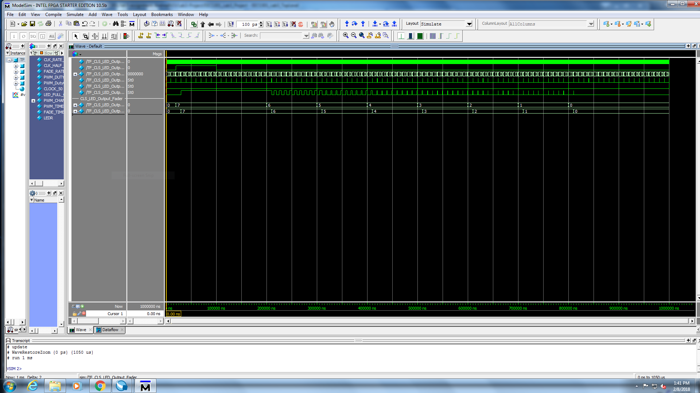
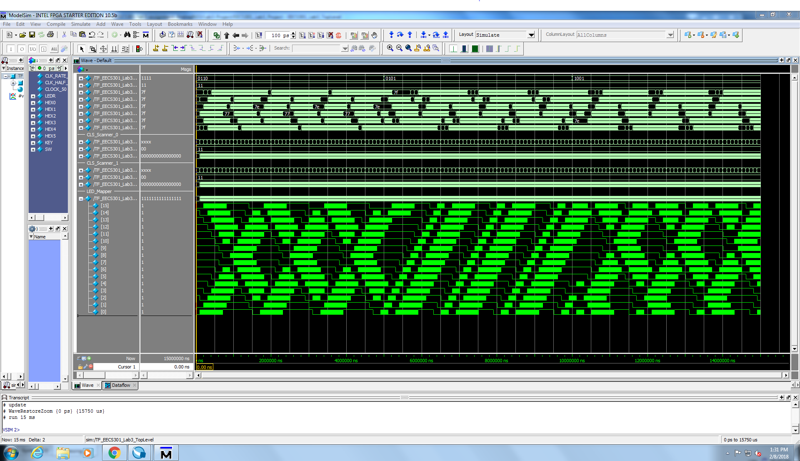

# EECS301 Lab #3 Report

* **Andrea Norris** (adn33@case.edu)
* **Team #6**
* **Github User: AndreaN33**

## Introduction
In this lab I modified and added to the code from Lab 2 to create two chaser light displays that run
independently along the outside of the Seven-Segment LED Display. The two lights are turned on and off 
by the rightmost switches on the board, and their motion controlled using the push buttons. In this lab
I learned more about how to use the push buttons and switches on the board, primarily how to synchronize this 
new input with the rest of my system to prevent errors. I also began to learn about how to instantiate shift
registers in HDL. 

## Implementation Details
**CLS_LED_Output_Fader**
CLS_LED_Output_Fader works by combining a look up table and a multiplexer to decide what brightness level the LED in question should have
and outputting the signal corresponding to that level. Inputs are the Fade_Timer_Tick, LED_Full_On, PWM_Timer_Tick, and the 6-bit wide registers
PWM_Channel_Sigs. First, a lookup table is used to decide if the led in question should be fully bright, at some varying level of brightness, 
or off. If LED_Full_On is on, the led brightness is set to full. If LED_Full is not on, the led brightness decreases until it is zero, and then stays
there. The brightness only updates on the Fade_Timer_Tick, otherwise it stays as is. After this data is processed and led_brightness_reg is updated,
the data is sent to led_mux_select on the PWM_Timer_Tick. This select data is used to select between the different PWM_Channel_Sigs in a multiplexer.
These different signals are updated to LEDR on the clock tick.

**CLS_Scanner_Module**
CLS_Scanner_Module takes in information about button presses and uses that information to determine which direction the led pattern 
should move and help regulate the brightness. It uses pulse width modulation and multiple duty cycle timers (recycled from Lab 2)
to provide input for CLS_LED_Output_Fader modules that generate the LED_OUT brightness data register. CLS_Scanner_Module uses generation
to generate fader modules for each LED.

**Key_Synchronizer_Module**
Key_Synchronizer_Module instantiates the CDC_Input_Synchronizer, which implements a register chain that synchronizes the 
system inputs with the rest of the system and prevents any metastability reaching other modules. 
The module also implements some basic registered logic so that Key_Event - the signal indicating a key has been pressed - is only updated
when the synchronized key input key_sync is high and the key lockout signal key_lock_out is low. This prevents the key signal from updating
while the rollover counter is active and LED brightness are being updated. 

No difficulties were had in refactoring the modules taken from Lab 2.

## Verification Results
The functionality of both the LED Output Fader and the whole program was verified using ModelSim. The 
waveforms from these simulations are attached below.

In the first run of the Top Level Simulator, no waveforms were being generated other than those
generated directly in the top level file. The error ended up being in the instantiation of the CLS_Output_Fader 
module, where I had forgotten to provide the clock signal to the module. After this was fixed, the waveforms 
generated as expected.

## Conclusions
While implementing this code, I became much more competent in reading the block diagrams and understanding 
how my code correlated to the functionality of the components shown. I also became a lot more confident in my
ability to process signals so that they would be synchronized with the system. The main takeaway from this lab 
for me was a reaffirming of my abilities to understand how the code functions and use that understanding to 
troubleshoot errors. For this reason, I had to spend much less time finding and correcting syntax errors since 
I better understood how to implement basic functions. I also had to spend less time correcting the actual waveform since I was able 
to trace where all the output signal had originated and what internal signals had an impact on their 
generation. 

## Computer Usage Information & Time Spent
In total I spent eight hours on this project. Approximately four to five of those hours were spent writing 
code and clearing out syntax errors. The other three hours were spent debugging my waveform, a process which was 
expidited by the help of the TAs in catching small errors. 

## Difficulties / Issues
This lab went much more smoothly than the previous lab. I felt as though I had a much better understanding of what 
was expected of me, and I understood the code that I was intended to write and how it interacted 
with provided code. This made the debugging process easier as well, since it was much simpler to trace errors to 
their source when I knew what was happening in the code. I think this was also helped by the addition 
of a second testbench, which allowed me to confirm that some of my code was working and therefore narrow down 
the number of files in which a bug could be located. 
